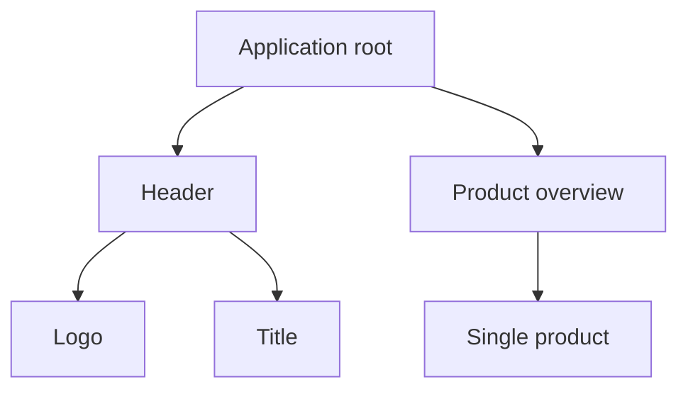

```yaml
title: Components - ngSquare
theme: default
highlighter: shiki
transition: slide-left
lineNumbers: false
info: false
drawings:
  persist: false

layout: cover
background: https://images.unsplash.com/photo-1513116917658-bdc8f9e49348?q=80&w=2400&auto=format&fit=crop&ixlib=rb-4.0.3&ixid=M3wxMjA3fDB8MHxwaG90by1wYWdlfHx8fGVufDB8fHx8fA%3D%3D
image: images/gradient-icon---large.gif
hideInToc: true
```

# Components

<div class="pt-12">
  <span @click="$slidev.nav.next" class="px-2 py-1 rounded cursor-pointer" hover="bg-white bg-opacity-10">
    Press Space for next page <carbon:arrow-right class="inline"/>
  </span>
</div>

<div class="abs-br m-6 flex gap-2">
  <a href="https://github.com/ng-square/slides" target="_blank" alt="GitHub" title="Open in GitHub"
    class="text-xl slidev-icon-btn opacity-50 !border-none !hover:text-white">
    <carbon-logo-github />
  </a>
</div>

---

```yaml
hideInToc: true
```

# Table of contents

<Toc maxDepth="1"></Toc>

---
layout: cover
---

# Introduction to Components

---

## What is a Component?

- Core Building Block: Encapsulates a part of the UI
- Structure:
  - TypeScript class (behavior)
  - Template file (HTML view)
  - Optional CSS file (styling)
- Handles data, behavior and user interaction
- Communicates through inputs and outputs
- Reusable

---

## Components in an example application


---
layout: two-cols-header
---

## Component hierarchy

::left::


::right::



---
layout: two-cols-header
---

## Anatomy of a Component

::left:: 

- Class: Defines behavior and data.
- `@Component()` decorator: Marks class as component
- `selector`: Custom HTML tag
- `standalone`: flag to enable standalone component
- `imports`: necessary imports to make the component work
- `template`: HTML (can be a reference to a file)
- `styles`: CSS (can be a reference to a file)

::right::

```typescript
import { Component } from '@angular/core';
import { CommonModule } from '@angular/common';

@Component({
  selector: 'app-example',
  template: `<h1>Hello {{name}}!</h1>`,
  styles: [`h1 { color: red; }`],
  standalone: true,
  imports: [CommonModule]
})
export class ExampleComponent {
  private name = 'Roger'
}
```
---

## Creating a Component in Angular

Using the Angular CLI:
```
ng generate component componentName
```

Using NX:
```
nx g @nx/angular:component componentName
```

---
layout: cover
---

# Templates

---

## Interpolation

- Simple Expression Evaluation
  - Renders data in the template
- Syntax: Uses double curly braces <span v-html="'{{}}'"></span>
- Bind component class properties to the view
- Displaying dynamic text, properties
- Automatically escapes HTML and script tags

Example:
```typescript
// ts
name = 'Roger';
```

```html
<!-- html -->
<p>Hello, {{name}}!</p>
```

--- 

## Template Expressions

- Used within the template, evaluate to a value
- Support most JavaScript expressions
  - Restrictions: pure functions, no side-effects
  - e.g. no assignments, no new, no chaining of expressions, no increment operator
- Angular sanitizes bindings to prevent XSS

Example:

```typescript
// ts
calculateTotal() {
  return this.items.reduce((acc, item) => acc + item.price, 0);
}
```

```html
<!-- html -->
<p>The total is: CHF {{calculateTotal()}}</p>
```

---

## Template Statements

- Execute actions, respond to user input or events
- Used inside event binding `()`
- Common use cases: Handling clicks, form submissions

Example:

```typescript
// ts
handleClick() {
  console.log('Button clicked!');
}
```

```html
<!-- html -->
<button (click)="handleClick()">Click Me</button>
```

---

## Template reference variables

- Reference DOM elements in templates
- Defined with a hash symbol `#`
- Accessible within the template
- Use cases: Interact with elements directly, pass to methods

Example:

```typescript
// ts
logInput(value: string) {
  console.log(value);
}
```

```html
<!-- html -->
<input #myInput type="text">
<button (click)="logInput(myInput.value)">Log</button>
```

---

## Safe navigation operator

- Prevents access of undefined objects: Safely navigates object properties
- Syntax: `?.` for property or method access
- Use case: When unsure if a variable is null/undefined

Example:

```typescript
// ts
user = {
  name: 'Roger Federer' // Note: 'user' could be null or undefined at runtime.
};
```

```html
<!-- html -->
<p>The user's name is: {{user?.name}}</p>
```

---
layout: cover
---

# Input and Output Bindings

---
layout: cover
---

# Control Flow

---
layout: cover
---

# Pipes

---
layout: cover
---

# Lifecycle

---
layout: cover
---

# Architecture

---
layout: cover
---

# Best Practices

---
layout: cover
---

# Conclusion