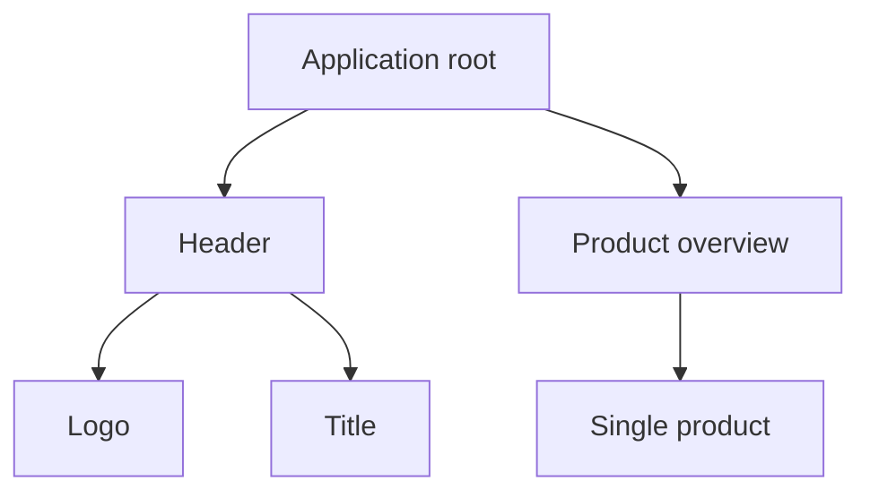

```yaml
title: Components - ngSquare
theme: default
highlighter: shikiji
transition: slide-left
lineNumbers: false
info: false
drawings:
  persist: false

layout: cover
background: https://images.unsplash.com/photo-1513116917658-bdc8f9e49348?q=80&w=2400&auto=format&fit=crop&ixlib=rb-4.0.3&ixid=M3wxMjA3fDB8MHxwaG90by1wYWdlfHx8fGVufDB8fHx8fA%3D%3D
image: images/gradient-icon---large.gif
hideInToc: true
```

# Components

<div class="pt-12">
  <span @click="$slidev.nav.next" class="px-2 py-1 rounded cursor-pointer" hover="bg-white bg-opacity-10">
    Press Space for next page <carbon:arrow-right class="inline"/>
  </span>
</div>

<div class="abs-br m-6 flex gap-2">
  <a href="https://github.com/ng-square/slides" target="_blank" alt="GitHub" title="Open in GitHub"
    class="text-xl slidev-icon-btn opacity-50 !border-none !hover:text-white">
    <carbon-logo-github />
  </a>
</div>

---

```yaml
hideInToc: true
```

# Table of contents

<Toc maxDepth="1"></Toc>

---

# What is a component?

- core element of our applications
- essential Angular concept
- logic in a TypeScript class
- template and styles referenced or inline
- services can be injected

---

## Components in the example application


---
layout: two-cols-header
---

## Component hierarchy

::left::


::right::



---
layout: two-cols-header
---

# How to create a component?

::left::

```ts
import { Component } from '@angular/core';
import { CommonModule } from '@angular/common';

@Component({
  selector: 'app-pizza-shop',
  standalone: true,
  imports: [CommonModule],
  templateUrl: './pizza-shop.component.html',
  styleUrl: './pizza-shop.component.scss',
})
export class PizzaShopComponent {}
```

::right::

- `@Component()` decorator with configuration object parameter 
  - `selector`: identifier of the component in other templates
  - `standalone`: flag to enable standalone component
  - `imports`: necessary imports to make the component work
  - references to `templateUrl` and `styleUrl`
  - Template and styles can also be defined inline

---
layout: image
image: task.svg
class: task-full
hideInToc: true
---

# Task B5.1

FIXME
- adjust the app.component to display a dummy text
- add comment in example app where to do this task
- use design systems (add docs here)

--- 

## Task B5.1 - Example solution

TODO

---
layout: two-cols-header
---

# Templates

## Interpolation

::left::

```ts
// template
<h1>{{appTitle}}</h1>
<p>{{pizza.name}}</p>
<p>{{addDelivery(pizza.price)}}</p>
<a href="/pizza/{{pizza.id}}">Details</a>

// typescript
appTitle = 'pizza shop';
pizza = {
   id: 1,
   name: "Hawaii",
   price: 25
};

addDelivery(price: number) {
   return price + 5;
}
```

::right::

- Interpolation = double courly braces `{{}}`
- Uses properties or functions of the component
- Interpolation is being replaced by the actual value
- `Template Expression` between the braces - e.g. for `addDelivery`
  - The expression is evaluated first, converted to a string and concatenated with other strings. Last, the value is assigned to the element.

---
layout: image
image: task.svg
class: task-full
hideInToc: true
---

# Task B5.2

- Create an address as an object literal. Use the fields street, town, zip code
- show the fields in a list
- write a function that outputs the whole address as a string
- Hint: unordered lists look like this

--- 

## Task B5.3 - Example solution

TODO

--- 

## Template Expressions

- between the interpolation parentheses, there is a so called expression `{{1 + 1}}`
- a reduced set of JavaScript
- no assignments allowed (=, +=, *=, ...)
- no new
- no side effects, as ++ (idempotency, pure Functions)

---

## Template Statements

- execution of side effects
- react to events (user actions)

```ts
<button (click)="deleteCustomer()">
    Delete Customer
</button>
```

---

# Bindings

## Overview

| Direction                   | Syntax                                              | Name                           |
|---                          |---                                                  |---                             |
| One-way, Component to View  | `{{expression}}` <br> `[property] = "expression"`   | Property, Attribute, Style,... | 
| One-way, View to Component  | `(event) = "statement()"`                           | Event                          | 
| Two-way                     | `[(property)] = "expression"`                       | Two-way                        | 

---

## Property Bindings

### Examples

```ts
<a [href]="url">Click me</a>
```

```ts
<button [disabled]="bool">Disabled: {{bool}}</button>
```

```ts
<postal-address [street]="address.street"></postal-address>
```

---
layout: image
image: task.svg
class: task-full
hideInToc: true
---

# Task B5.3

- Add an input element
- Bind the value of the street to the value-property of the input field
- Use a bal-input element

--- 

## Task B5.3 - Example solution

TODO

---

## HTML and DOM

- DOM is not really a model it is more or less an API to access HTML
- HTML knows attributes (e.g. `value`)
- DOM knows properties (e.g. `value`)
- HTML `value` is the inital value
- DOM `value` is the current value

---

## Attributes vs. Properties

- HTML Attribute initialize DOM Properties
- DOM Properties can change, attributes can not
- Bindings in Angular only work with DOM properties and events, <strong>NOT</strong> with HTML attributes

---

## Event bindings

### Examples

```ts
<button (click)="createPerson()">New Person</button>
```

```ts
<postal-address (customevent)="doSth()"></postal-address>
```

```ts
<people (deletePerson)="delete($event)">
```

---
layout: image
image: task.svg
class: task-full
hideInToc: true
---

# Task B5.4

- Add a Button
- You can use the bal-button
- Once clicked, call a method that prints sth. on the javascript console

--- 

## Task B5.4- Example solution

TODO

---

## Event object ($event)

- Contains information about the event
- If it's a native event, `$event` is a DOM event object
  - with properties like `target.value`
- Events have a type. E.g. `KeyboardEvent`, `MouseEvent` or custom events

```ts
<input (input)="print($event.target.value)">
print(value) {
   console.log(value);  
}

// or

<input (input)="printEvent($event)">
printEvent(event) {
   console.log(event.target.value);
}
```

---
layout: image
image: task.svg
class: task-full
hideInToc: true
---

# Task B5.5

- Add an Input element.
- Print any new value on the console that starts with the letter 's'.

--- 

## Task B5.5 - Example solution

TODO

---
layout: image
image: task.svg
class: task-full
hideInToc: true
---

# Task B5.6

- Create a self-created two-way data binding for an Input field.
- Create an input field with a binding for a string, e.g. "name".
- Create a text block (<p>-Tag) containing the value from the input field.
- Use a Property binding, an Event binding and a variable in the component.

--- 

## Task B5.6 - Example solution

TODO

---

## Template reference variable