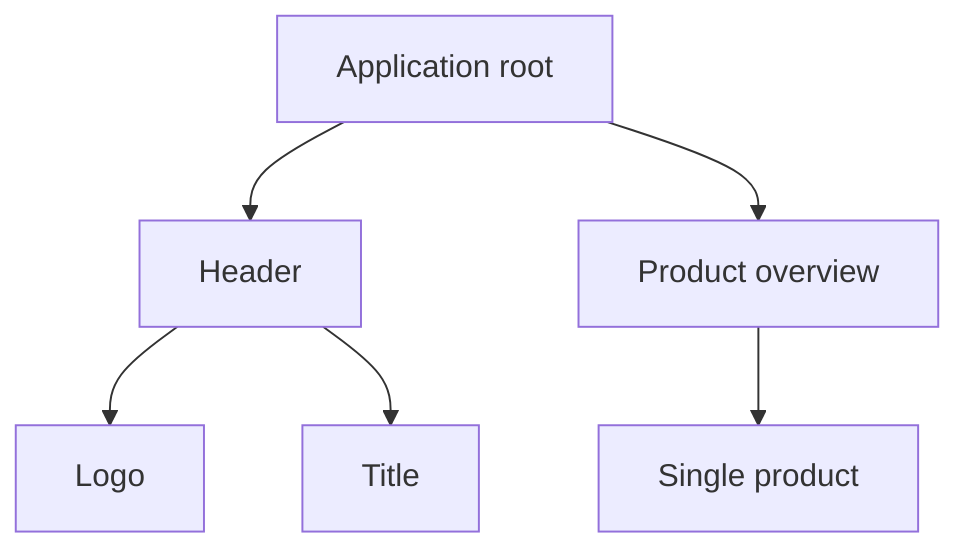

```yaml
title: Components - ngSquare
theme: default
highlighter: shikiji
transition: slide-left
lineNumbers: false
info: false
drawings:
  persist: false

layout: cover
background: https://images.unsplash.com/photo-1513116917658-bdc8f9e49348?q=80&w=2400&auto=format&fit=crop&ixlib=rb-4.0.3&ixid=M3wxMjA3fDB8MHxwaG90by1wYWdlfHx8fGVufDB8fHx8fA%3D%3D
image: images/gradient-icon---large.gif
hideInToc: true
```

# Components

<div class="pt-12">
  <span @click="$slidev.nav.next" class="px-2 py-1 rounded cursor-pointer" hover="bg-white bg-opacity-10">
    Press Space for next page <carbon:arrow-right class="inline"/>
  </span>
</div>

<div class="abs-br m-6 flex gap-2">
  <a href="https://github.com/ng-square/slides" target="_blank" alt="GitHub" title="Open in GitHub"
    class="text-xl slidev-icon-btn opacity-50 !border-none !hover:text-white">
    <carbon-logo-github />
  </a>
</div>

---

```yaml
hideInToc: true
```

# Table of contents

<Toc maxDepth="1"></Toc>

---

# What is a component?

- core element of our applications
- essential Angular concept
- logic in a TypeScript class
- template and styles referenced or inline
- services can be injected

---

## Components in the example application


---

## Component hierarchy



---

# How to create a component?

```ts
import { Component } from '@angular/core';
import { CommonModule } from '@angular/common';

@Component({
  selector: 'app-pizza-shop',
  standalone: true,
  imports: [CommonModule],
  templateUrl: './pizza-shop.component.html',
  styleUrl: './pizza-shop.component.scss',
})
export class PizzaShopComponent {}
```

---

## Requirements for a component

- `@Component()` decorator with configuration object parameter 
  - `selector`: identifier of the component in other templates
  - `standalone`: flag to enable standalone component
  - `imports`: necessary imports to make the component work
  - references to `templateUrl` and `styleUrl`
  - Template and styles can also be defined inline

--- 

# Task 5.1

FIXME
- adjust the app.component to display a dummy text
- add comment in example app where to do this task
- use design systems (add docs here)

--- 

## Task 5.1 - Example solution

TODO

---

# Templates