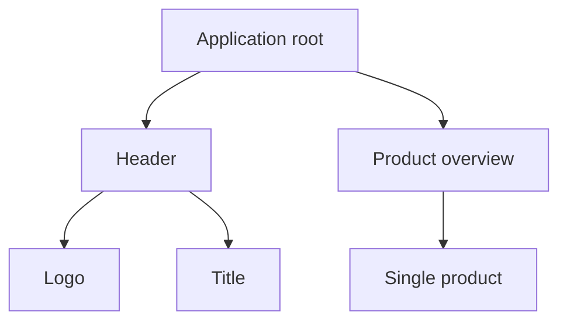

```yaml
title: Components - ngSquare
theme: default
highlighter: shiki
transition: slide-left
lineNumbers: false
info: false
drawings:
  persist: false

layout: cover
background: https://images.unsplash.com/photo-1513116917658-bdc8f9e49348?q=80&w=2400&auto=format&fit=crop&ixlib=rb-4.0.3&ixid=M3wxMjA3fDB8MHxwaG90by1wYWdlfHx8fGVufDB8fHx8fA%3D%3D
image: images/gradient-icon---large.gif
hideInToc: true
```

# Components

<div class="pt-12">
  <span @click="$slidev.nav.next" class="px-2 py-1 rounded cursor-pointer" hover="bg-white bg-opacity-10">
    Press Space for next page <carbon:arrow-right class="inline"/>
  </span>
</div>

<div class="abs-br m-6 flex gap-2">
  <a href="https://github.com/ng-square/slides" target="_blank" alt="GitHub" title="Open in GitHub"
    class="text-xl slidev-icon-btn opacity-50 !border-none !hover:text-white">
    <carbon-logo-github />
  </a>
</div>

---

```yaml
hideInToc: true
```

# Table of contents

<Toc maxDepth="1"></Toc>

---
layout: cover
---

# Introduction to Components

---

## What is a Component?

- Core Building Block: Encapsulates a part of the UI
- Structure:
  - TypeScript class (behavior)
  - Template file (HTML view)
  - Optional CSS file (styling)
- Handles data, behavior and user interaction
- Communicates through inputs and outputs
- Reusable

---

## Components in an example application


---
layout: two-cols-header
---

## Component hierarchy

::left::


::right::



---
layout: two-cols-header
---

## Anatomy of a Component

::left:: 

- Class: Defines behavior and data.
- `@Component()` decorator: Marks class as component
- `selector`: Custom HTML tag
- `standalone`: flag to enable standalone component
- `imports`: necessary imports to make the component work
- `template`: HTML (can be a reference to a file)
- `styles`: CSS (can be a reference to a file)

::right::

```typescript
import { Component } from '@angular/core';
import { CommonModule } from '@angular/common';

@Component({
  selector: 'app-example',
  template: `<h1>Hello {{name}}!</h1>`,
  styles: [`h1 { color: red; }`],
  standalone: true,
  imports: [CommonModule]
})
export class ExampleComponent {
  private name = 'Roger'
}
```
---

## Creating a Component in Angular

Using the Angular CLI:
```
ng generate component componentName
```

Using NX:
```
nx g @nx/angular:component componentName
```

---
layout: cover
---

# Templates

---

## Interpolation

- Simple Expression Evaluation
  - Renders data in the template
- Syntax: Uses double curly braces <span v-html="'{{}}'"></span>
- Bind component class properties to the view
- Displaying dynamic text, properties
- Automatically escapes HTML and script tags

Example:
```typescript
// ts
name = 'Roger';
```

```html
<!-- html -->
<p>Hello, {{name}}!</p>
```

--- 

## Template Expressions

- Used within the template, evaluate to a value
- Support most JavaScript expressions
  - Restrictions: pure functions, no side-effects
  - e.g. no assignments, no new, no chaining of expressions, no increment operator
- Angular sanitizes bindings to prevent XSS

Example:

```typescript
// ts
calculateTotal() {
  return this.items.reduce((acc, item) => acc + item.price, 0);
}
```

```html
<!-- html -->
<p>The total is: CHF {{calculateTotal()}}</p>
```

---

## Template Statements

- Execute actions, respond to user input or events
- Used inside event binding `()`
- Common use cases: Handling clicks, form submissions

Example:

```typescript
// ts
handleClick() {
  console.log('Button clicked!');
}
```

```html
<!-- html -->
<button (click)="handleClick()">Click Me</button>
```

---

## Template reference variables

- Reference DOM elements in templates
- Defined with a hash symbol `#`
- Accessible within the template
- Use cases: Interact with elements directly, pass to methods

Example:

```typescript
// ts
logInput(value: string) {
  console.log(value);
}
```

```html
<!-- html -->
<input #myInput type="text">
<button (click)="logInput(myInput.value)">Log</button>
```

---

## Safe navigation operator

- Prevents access of undefined objects: Safely navigates object properties
- Syntax: `?.` for property or method access
- Use case: When unsure if a variable is null/undefined

Example:

```typescript
// ts
user = {
  name: 'Roger Federer' // Note: 'user' could be null or undefined at runtime.
};
```

```html
<!-- html -->
<p>The user's name is: {{user?.name}}</p>
```

---
layout: cover
---

# Input and Output Bindings

---

## Intro

- Facilitates component communication
- Input: Pass data to child
- Output: Emit events to parent
- Use @Input() and @Output() decorators

--- 

## Bindings Overview

| Direction                   | Syntax                                              | Name                           |
|---                          |---                                                  |---                             |
| One-way, Component to View  | `[property] = "expression"`                         | Property, Attribute, Style,... | 
| One-way, View to Component  | `(event) = "statement()"`                           | Event                          | 
| Two-way                     | `[(property)] = "expression"`                       | Two-way                        | 

---

## Input Binding

- Pass data parent to child
- Decorator `@Input()` marks property
- Facilitates parent to child communication
- Usage in parent's template

Example:

```html
<app-child [childProperty]="parentValue"></app-child>
```

```html
<a [href]="url">Click me</a>
```

```html
<button [disabled]="bool">Click me</button>
```

---

## Output Binding

- Emit events from child to parent
- Decorator `@Output()` with EventEmitter
- Facilitates child to parent communication
- Usage: In child's template or class

Example:

```html
<!-- child component -->
<button (click)="sendEvent()">Send to Parent</button>
```

```typescript
// child component
@Output() childEvent = new EventEmitter<string>();
sendEvent() {
  this.childEvent.emit('Message from Child');
}
```

```html
<!-- parent component -->
<app-child (childEvent)="handleChildEvent($event)"></app-child>
```

---

## Event object

- Represents event data
- Passed automatically in event bindings
- Accessible in template expressions
- Commonly used in DOM events
  - If it's a native event, `$event` is a DOM event object with properties like `target.value`
- Have a type. E.g. `KeyboardEvent`, `MouseEvent` or custom events

Example:

```html
<button (click)="onClick($event)">Click Me</button>
```

```typescript 
onClick(event: MouseEvent) {
  console.log('Button clicked', event);
}
```

---

## Two-way binding

- Synchronizes model and view
- Uses [(ngModel)] for binding
- Requires FormsModule import
- Simplifies form handling

```html
<input [(ngModel)]="user.name" placeholder="Enter name">
```

```typescript
user = { name: '' };
```

---

## Class binding

- Dynamically add/remove CSS classes
- Uses [class.className] or [ngClass]
- Evaluated as true/false expressions
- Enhances conditional styling


Example for a single class:

```html
<div [class.active]="user.isOnline"></div>
```

Example for multiple classes:

```html
<div [ngClass]="{
  'active': user.isOnline,
  'inactive': !user.isOnline}">
</div>
```

---

## Style binding

- Dynamically sets inline styles
- Syntax: [style.styleProperty]="expression"
- Supports conditionals for dynamic styling
- Directly applies styles to elements
- <strong>usage not recommended!</strong>

Exmple:

```html
<span [style.font-weight]="user.isOnline ? 'bold' : 'normal'">
</span>
```

---
layout: cover
---

# Control Flow

---

## About control flows

- Used to show, hide and repeat elements
- Three elements: `@if`, `@for` and `@switch`
- Available since Angular 17
- Alternative: Strctural directives
  - `*ngIf`, `*ngFor`, `*ngSwitch`

---

## `@if`

- Will display content if the conditional expression is truthy
  - Element is removed from DOM when `@if` is falsy, compared to just hiding with CSS
- Can be associated with one or more `@else` blocks
- Directly after the if block there can be one or more `@else if` blocks

Example: 

```html
@if (a > b) {
  {{a}} is greater than {{b}}
} @else if (b > a) {
  {{a}} is less than {{b}}
} @else {
  {{a}} is equal to {{b}}
}
```

Old syntax: `<div *ngIf="a > b"></div>`

--- 

## `@if` - reference the conditional expression's result

- The result of the conditional expression might be assigned to a variable which can be used in the `@if` block

Example:

```html
@if (users$ | async; as users) {
  {{ users.length }}
}
```

---

## `@for`

- Used render content repeatedly for each item in a collection
- `track` expression determines the key of the array items 
  - Used to reduce DOM operations
- Inside the `@for` there are iteration variables available
  - `$count`, `$index`, `$first`, `$last`, `$even`, `$odd`

Example:

```html
@for (item of items; track item.id; let idx = $index, e = $even) {
  Item {{idx}}  -  {{ item.name }}
}
```

Old syntax: `<div *ngFor="item of items"></div>`

---

## `@for` - empty block

- An optional `@empty` block can be used after the `@for` block
- The empty-block is displayed if there are no items available inside the array

Example:

```html
@for (item of items; track item.name) {
  <li> {{ item.name }} </li>
} @empty {
  <li> There are no items. </li>
}
```

---

## `@switch`

- Can be used like a regular switch statement
  - No fallthrough
- `@default` is optional - if there is no match, nothing will be displayed

Example:

```html
@switch (condition) {
  @case (caseA) {
    Case A.
  }
  @case (caseB) {
    Case B.
  }
  @default {
    Default case.
  }
}
```

Old syntax: `<div [ngSwitch]="condition"><p *ngSwitchCase="caseA"></p></div>`


---
layout: cover
---

# Pipes

---
layout: cover
---

# Lifecycle

---
layout: cover
---

# Architecture

---
layout: cover
---

# Best Practices

---
layout: cover
---

# Conclusion